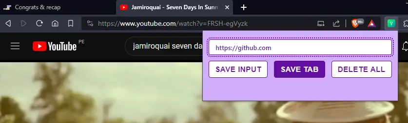
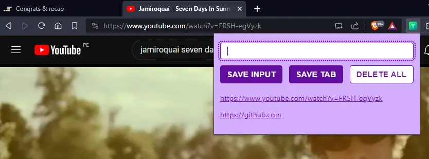

# Desarrollar una Chrome Extension
Esto es parte del curso ["Learn JavaScript"](https://scrimba.com/learn/learnjavascript) por [Scrimba](https://scrimba.com/).


📌 [Screenshot](#screenshot)

📌 [Link](#link)

📌 [Desarrollado con](#desarrollado-con)

📌 [Lo que aprendí](#lo-que-aprendí)

📌 [Recursos útiles](#recursos-útiles)

## Screenshot




## Link
[My scrim](https://scrimba.com/scrim/ceGLeqAq) 👀

## Desarrollado con
🎯 HTML semántico

🎯 CSS propiedades personalizadas

🎯 Flexbox

🎯 CSS Grid


## Lo que aprendí
✅ **JSON.parse(string)** - Recibe un *string* como argumento y devuelve un *objeto*.
```js
JSON.parse( localStorage.getItem("myLeads") )
```

✅ **JSON.stringify(object)** - Recibe un *objeto* como argumento y devuelve un *string*.
```js
JSON.stringify(myLeads)
```

✅ **localStorage.setItem("key", "value")** - Almacena un valor en una clave.
```js
localStorage.setItem("myLeads", JSON.stringify(myLeads))
```

✅ **localStorage.getItem("key")** - Recupera el valor a través de la clave.
```js
let leadsFromLocalStorage = JSON.parse( localStorage.getItem("myLeads") )
```

✅ **localStorage.clear()** - Remueve todo lo almacenado.
```js
localStorage.clear()
```

✅ **Chrome extensions API** - Esta API se utiliza para interacturar con las pestañas del navegador.
```js
chrome.tabs.query ( {active: true, currentWindow: true}, function(tabs) {
  // code...
} )
```
+ **active: true** ➡ significa que la pestaña debe estar activa.
+ **currentWindow: true** ➡ significa que la busqueda debe realizarse solo en la ventana actual.
+ **function(tabs)** ➡ Es el callback que se ejecutará después de que se complete las consultas de pestañas.

✅ **manifest.json** - Proporciona información sobre la extensión y define cómo debe comportarse en el navegador.
```js
{
  // INDÍCA LA VERSIÓN DEL MANIFIESTO
  "manifest_version": 3,

  // INDÍCA LA VERSIÓN DE LA EXTENSIÓN
  "version": "1.1",

  // NOMBRE DE LA EXTENSIÓN
  "name": "Leads tracker",

  // ACCIONES O COMPORTAMIENTOS ESPECÍFICOS
  "action": {
    // AL HACER CLIC, LA EXTENSIÓN SE ABRIRÁ EN UN POPUP
    "default_popup": "index.html",

    // ÍCONO POR DEFECTO
    "default_icon": "icon.png"
  },
  // ENUMERA LOS PERMISOS QUE LA EXTENSIÓN SOLICITA
  "permissions": [
    // SIGNIFICA QUE PUEDE INTERACTUAR CON LAS PESTAÑAS ABIERTAS DEL NAVEGADOR
    "tabs"
  ]
}
```

## Recursos útiles
🖼 Ícono - [Filter](https://iconscout.com/icons/filter) by [Mohit Gandhi](https://iconscout.com/contributors/mcgandhi61) on [IconScout](https://iconscout.com)
