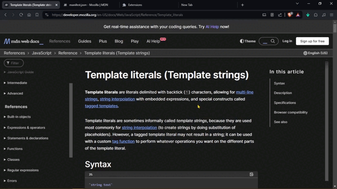
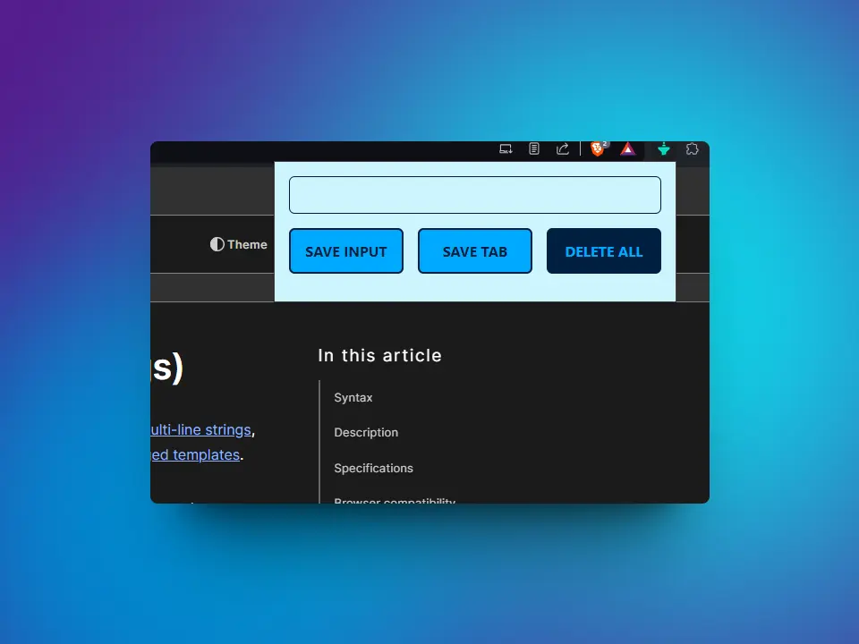
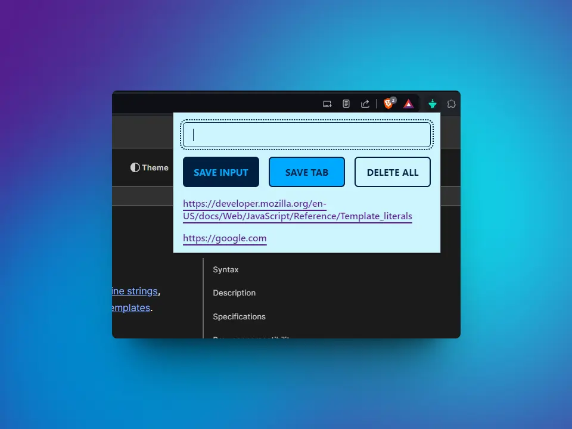

# Chrome Extension

This is my solution from the project: ***Chrome Extension*** from [***Frontend Career Path***](https://scrimba.com/learn/frontend) - Module 3 by [***Scrimba***](https://scrimba.com/).



### Table of contents
+ [The goals](#the-goals)
+ [Screenshots](#screenshots)
+ [Links](#links)
+ [What I learnt](#what-i-learnt)
+ [Useful resources](#useful-resources)
+ [Author](#author)

## *The goals*
Create a Chrome extension that allows:

🎯 Store the URL of the current tab.

🎯 Store the URL entered in the input text.

🎯 The storage must be in the localStorage.

🎯 Every time we `click` on any `SAVE ...` button, it should display the rendered data below them.

🎯 When we `double-click` on the `DELETE ...` button, 
it must clear the rendered data below the buttons, in addition to clearing the localStorage.

## *Screenshots*





## *Links*

[Scrim](https://scrimba.com/scrim/c6qWkLcG) 👀

[See all my FCP projects](https://github.com/mendez-v/frontend-career-path) 👀

## *What I learnt*
#### 🔥 `Template Strings`
+ Allows the creation of text strings with interpolation of variables and expressions.
```js
    listItem += `
    <li>
      <a class="list__cta" href=${lead[i]} target="_blank" rel="noreferrer">
        ${lead[i]}
      </a>
    </li>
    `
```
#### 🔥 `element.innerHTML`
+ Allows you to access and modify the HTML content within an element.
+ You can insert or change HTML element inside another element.
```js
 ulEl.innerHTML = listItem
```
#### 🔥 `localStorage`
+ Allows data to be persistently stored in the browser.
+ The stored data is still available even after closing and reopening the browser; and is available to a specific domain.
+ The storage is based on key-value pairs; where the key is a string and the value can be any object.
+ The storage capacity varies by browser.
```js
// Store value
localStorage.setItem("myCat", "Tom")
// Get value
const cat = localStorage.getItem("myCat")
// Remove item
localStorage.removeItem("myCat")
// Remove all
localStorage.clear()
```
#### 🔥 ``JSON.stringify()``
+ Converts a JavaScript object to a JSON string.
+ Takes the object as an argument and returns a string.
```js
localStorage.setItem("myLeads", JSON.stringify(leadsArr))
```
#### 🔥 `JSON.parse()`
+ Converts a string to a JavaScript object.
+ Takes the string as an argument and returns an object.
```js
const leadsFromLocalStorage = JSON.parse(localStorage.getItem("myLeads"))
```
#### 🔥 `manifest.json`
+ It is a metadata file used in web applications and browser extensions.
+ Contains information about the application, such as its name, version, description, and associated files. 
+ This file tells the browser how the application or extension should behave, and what elements should be displayed for each web page. 
+ It is essential for the functioning of Progressive Web Apps (PWA) and browser extensions.
```js
{
  "manifest_version": 3,
  "version": "1.0",
  "name": "Leads tracker",
  "action": {
    "default_popup": "index.html",
    "default_icon": "./icon.png"
  },
  "permissions": [
    "tabs"
  ]
}
```
## *Useful resources*

🤓 [MDN](https://developer.mozilla.org/en-US/)

## *Author*

✨ Frontend Mentor - [@mendez-v](https://www.frontendmentor.io/profile/mendez-v)